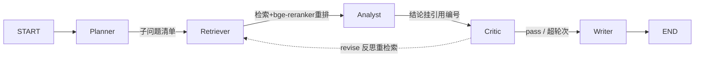

# 金融研报 Agent

输入股票名称或代码（如 `贵州茅台 600519`），程序会检索财报和行情数据，经过
Planner、Retriever、Analyst、Critic、Writer 五个节点，生成一份带引用、可回查原始数据的
研报草稿。


## 架构



| 层 | 选型 |
|---|---|
| 编排 | LangGraph（Critic 要求修改时，会带着意见重新检索） |
| 检索 | bge 系列 embedding + FAISS + bge-reranker 重排 |
| LLM | 任意 OpenAI 兼容端点（DeepSeek / 通义 / 自托管 vLLM 均可） |
| 数据 | akshare（A股财报 / 行情 / 估值） |
| 评估 | LLM-as-Judge：faithfulness / context_precision / answer_correctness |
| 工程 | Docker + pytest + GitHub Actions |

## 快速开始

```bash
pip install -e ".[dev]"                    # 基础依赖和测试工具
cp .env.example .env                       # 填入 LLM_API_KEY；留空则使用离线 stub

python demo_function_calling.py            # Function Calling loop 示例
pip install -e ".[rag]"                    # 安装 akshare 和 FlagEmbedding
python scripts/build_index.py 600519 000858 # 获取财务数据并建立向量库
python main.py "贵州茅台 600519"            # 生成研报，结果写入 reports/
pytest -q                                  # 运行测试
```

没有 API key 或 FlagEmbedding 也可以运行：LLM 会使用占位 stub，embedding 会使用
确定性伪向量。这种模式适合检查流程是否正常，不适合评估检索效果。测试和 CI 通过
`RAG_FAKE_EMBED=1` 避免联网和下载模型。

### 模型下载（国内网络）

代码默认使用 `HF_ENDPOINT=https://hf-mirror.com`。如果下载仍不稳定，也可以从
ModelScope 获取同款模型，或使用 `scripts/robust_download.py` 分块下载。这个脚本会检查
HTTP 206 响应和 SHA256，已完成的分块不需要重新下载。

```bash
export HF_ENDPOINT=https://hf-mirror.com
huggingface-cli download BAAI/bge-m3
huggingface-cli download BAAI/bge-reranker-v2-m3
```

如果只想先跑起来，可以换成约 100MB 的 `bge-small-zh-v1.5`。在
`configs/settings.yaml` 中修改 `embed_model`，然后重新建立索引即可。伪向量不包含语义
信息，只用于测试流程。

### Docker

```bash
docker build -t finance-report-agent .
docker run --rm --env-file .env \
  -v ./data:/app/data -v ./reports:/app/reports \
  finance-report-agent python main.py "贵州茅台 600519"
```

镜像只包含基础依赖，大小约 300MB，可以直接使用 API 模式。由于 torch 和 bge 相关依赖
体积较大，建议先在宿主机建立索引，再将 `data/` 挂载到容器。不传 `.env` 时会使用离线
stub，CI 的冒烟测试也使用这种方式。

## 进度

- [x] 脚手架 + Function Calling demo
- [x] RAG：akshare 真实财务数据 + FAISS + 重排
- [x] LangGraph 多智能体 + 反思重检索 + 全局引用编号
- [x] 评估框架：LLM-as-Judge 三指标 + 多配置对比 runner
- [x] 微调 bge-reranker（本地 M2/MPS，`scripts/make_rerank_dataset.py` + `scripts/train_reranker.py`）
- [x] SFT 蒸馏 Qwen2.5-7B + OpenAI 兼容部署（云端 4090，材料在 [sft/](sft/)）
- [x] Docker + CI

## 实验结果

### reranker 对比

评测集包含 17 家公司的财务数据和 15 道题，题目分为三类：多公司单点查询、跨公司对比、
不指定公司名的筛选。下面三组实验使用相同的索引和召回结果，只更换重排器：

| 配置 | faithfulness | context_precision | answer_correctness |
|---|---|---|---|
| baseline（不重排） | 0.800 | 0.333 | 0.793 |
| rerank（通用 bge-reranker-base） | 0.644 | 0.280 | 0.767 |
| rerank_ft（域内微调后） | 0.800 | 0.347 | 0.793 |

在这组表格式中文财务文本上，通用 reranker 的效果不如不重排，faithfulness 从 0.800
降到 0.644。检查结果后发现，一些正确段落在重排时被移到了后面。

微调数据由 LLM 根据各个 chunk 生成问题，再通过 FAISS 挖掘难负样本，共 201 条训练数据
和 33 条验证数据。微调后，dev acc@1 从 0.879 提升到 1.0；三项最终指标也恢复到或略高于
baseline。详细结果见 [eval_results.md](eval_results.md)。

### SFT 蒸馏

使用 DeepSeek 生成 201 条金融 RAG 问答数据，再通过 LoRA 微调 Qwen2.5-7B-Instruct。
在 RTX 4090 上训练 3 个 epoch 约需 4 分钟，train loss 为 0.39，eval loss 为 0.29。
模型通过 OpenAI 兼容接口部署，并与 DeepSeek 回答同一批 15 道题；两组结果都由
DeepSeek 评估：

| 模型 | 参数量 | faithfulness | answer_correctness |
|---|---|---|---|
| 老师 DeepSeek | 671B | 0.733 | 0.793 |
| 学生 Qwen2.5-7B-ft | 7B | 0.733 | 0.800 |

在这组评测中，7B 模型的两项分数与 DeepSeek 接近。两个模型答错的是相同的 3 道题，
均属于“不指定公司名的筛选”，原因是检索阶段没有召回所需内容。切换到自托管模型时，
只需修改 `.env` 中的 `LLM_BASE_URL` 和 `LLM_MODEL`。

### 评测边界

这些数字来自 17 家公司、15 道题的内部评测集，用于比较同一数据和检索配置下的相对变化，
不代表通用金融问答能力。SFT 数据由 DeepSeek 蒸馏，当前答案评委也使用 DeepSeek，存在
同源模型偏好；因此这里只报告内部对比，不把结果解释为学生模型在通用能力上超过教师。
后续将加入独立 Judge、人工抽检和按公司隔离的测试集。

机器可读的汇总结果见
[`artifacts/eval_summary.json`](artifacts/eval_summary.json)，完整表格见
[`eval_results.md`](eval_results.md)。

## 实战笔记

- [踩坑与设计记录](docs/踩坑与设计记录.md)：记录多智能体死循环、角色划分、弱网下载、
  macOS 深度学习环境、数据质量和评测设计等问题。

本项目仅用于学习和实验，不构成投资建议。
