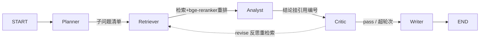

# 金融研报 Agent

给定一支股票/一个行业，自动检索财报、行情、研报片段，经 **Planner→Retriever→Analyst→Critic→Writer**
多智能体协作，产出**带数据、带引用、可溯源**的研报草稿。


## 架构



| 层 | 选型 |
|---|---|
| 编排 | LangGraph（状态图，支持 Critic 反思回路） |
| 检索 | bge-m3 编码 + FAISS + bge-reranker 重排 |
| LLM | 任意 OpenAI 兼容端点（DeepSeek / 通义 / 本地 vLLM） |
| 数据 | akshare（A股财报/行情/公告）+ 研报 PDF |
| 评估 | RAGAS（faithfulness 等）+ LLM-as-Judge |
| 工程 | Docker + pytest + GitHub Actions |

## 快速开始

```bash
pip install -e ".[dev]"          # 基础依赖 + 测试
cp .env.example .env             # 填入 LLM_API_KEY（不填也能跑离线 stub）

python demo_function_calling.py  # 阶段A：Function Calling 演示
pip install -e ".[rag]"          # 阶段B：装 akshare + bge-m3（首次会下载 ~2GB 模型）
python scripts/build_index.py 600519 000858   # 拉真实财务数据 + 建向量库
python main.py "贵州茅台 600519" # 端到端生成研报 -> reports/
pytest -q                        # 全部测试
```

> **离线模式**：未配置 API key / 未装 FlagEmbedding / 模型未下载时，LLM 走占位 stub、embedding 走确定性伪向量，
> 整条链路仍可跑通——方便先理解结构，再逐阶段接入真实组件。

### 国内网络：下载 bge-m3 / bge-reranker
代码已默认走镜像 `HF_ENDPOINT=https://hf-mirror.com`（见 [embedder.py](src/rag/embedder.py)）。
首次用真实 embedding 前，建议先在**稳定网络**下预下载模型（~2.2GB，直连 huggingface.co 常失败）：

```bash
pip install -U "huggingface_hub[cli]"
export HF_ENDPOINT=https://hf-mirror.com
huggingface-cli download BAAI/bge-m3
huggingface-cli download BAAI/bge-reranker-v2-m3   # 阶段 D 精排用
```

下载好后再跑 `python scripts/build_index.py 600519 000858`，`embedder.real` 会变 `True`，
检索即为真实语义（伪向量模式下检索结果不可信，仅用于打通流程）。

> 测试/CI 设 `RAG_FAKE_EMBED=1` 强制伪向量，全程不触网、不下载模型（`pytest` < 1s）。

## 开发路线（对应 `../Agent项目落地方案.md`）
- [x] 脚手架 + Function Calling demo（阶段 A）
- [x] RAG：真实 akshare 财务数据 + bge-m3 + FAISS（阶段 B）
- [x] LangGraph 多智能体主系统 + 反思重检索 + 全局引用编号（阶段 D）
- [x] 评估框架：LLM-as-Judge（faithfulness/context_precision/correctness）+ 对比 runner（阶段 F）
- [x] 微调 bge-reranker（阶段 E-上：本地 M2/MPS 训练，`scripts/make_rerank_dataset.py` + `scripts/train_reranker.py`）
- [ ] LLaMA-Factory SFT + vLLM 部署（阶段 E-下：材料已就绪，见 [sft/](sft/)，需云端 GPU）
- [ ] Docker + CI 收尾（阶段 G）

## 评估结果（LLM-as-Judge / DeepSeek，详见 [eval_results.md](eval_results.md)）

17 家公司真实财务数据、15 题三梯度评测集（多公司单点 / 跨公司对比 / 无公司名筛选）：

| 配置 | faithfulness | context_precision | answer_correctness |
|---|---|---|---|
| baseline（不重排） | 0.800 | 0.333 | 0.793 |
| rerank（通用 bge-reranker-base） | 0.644 | 0.280 | 0.767 |
| **rerank_ft（域内微调后）** | **0.800** | **0.347** | **0.793** |

> **核心发现：通用重排器在垂直领域负迁移**（faithfulness -16pt），域内微调后收复并反超
> （vs 通用重排 context_precision/faithfulness 均相对 **+24%**）。微调数据由 LLM 合成
> query + FAISS 难负样本挖掘构造（201 train / 33 dev），训练层面 dev acc@1 0.879→1.0。

> 本地网速受限时 embedding 用 bge-small-zh-v1.5（~100MB）；好网络下改回
> `configs/settings.yaml` 的 `embed_model: BAAI/bge-m3` 并重建索引即可。

## 实战笔记

- [Stage E 踩坑记录](docs/踩坑记录-StageE.md)：本地微调全程 17 个真实问题的定位与修复
  （环境冲突 / 弱网下载 / macOS 深度学习栈兼容性 / 数据质量 / 评测设计）。

> 数据仅用于个人学习 demo，不构成投资建议。
