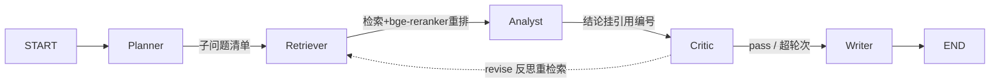

# 金融研报 Agent

输入一支股票（比如"贵州茅台 600519"），系统自动检索财报、行情数据，经
Planner → Retriever → Analyst → Critic → Writer 五个角色协作，生成一份带引用编号、
能溯源到原始数据的研报草稿。


## 架构



| 层 | 选型 |
|---|---|
| 编排 | LangGraph（状态图，Critic 判 revise 会带着意见打回重检索） |
| 检索 | bge 系列 embedding + FAISS + bge-reranker 重排 |
| LLM | 任意 OpenAI 兼容端点（DeepSeek / 通义 / 自托管 vLLM 均可） |
| 数据 | akshare（A股财报 / 行情 / 估值） |
| 评估 | 自建 LLM-as-Judge：faithfulness / context_precision / answer_correctness |
| 工程 | Docker + pytest + GitHub Actions |

## 快速开始

```bash
pip install -e ".[dev]"          # 基础依赖 + 测试
cp .env.example .env             # 填入 LLM_API_KEY（不填也能跑，走离线 stub）

python demo_function_calling.py  # 手写 Function Calling loop 的演示
pip install -e ".[rag]"          # 装 akshare + FlagEmbedding（要下 embedding 模型）
python scripts/build_index.py 600519 000858   # 拉财务数据 + 建向量库
python main.py "贵州茅台 600519" # 端到端生成研报 -> reports/
pytest -q                        # 全部测试
```

没配 API key、没装 FlagEmbedding 时，LLM 走占位 stub、embedding 走确定性伪向量，
整条链路照样能跑通——先看结构，再逐个换成真组件。测试和 CI 里设了
`RAG_FAKE_EMBED=1`，不触网不下模型，pytest 一秒内跑完。

### 模型下载（国内网络）

代码默认走 `HF_ENDPOINT=https://hf-mirror.com` 镜像。直连不稳的话有两个备选：
ModelScope 上有同款模型；仓库里的 `scripts/robust_download.py` 是给很差的网络准备的
（分块下载 + 强制 206 校验 + SHA256 验收，进度不回退）。

```bash
export HF_ENDPOINT=https://hf-mirror.com
huggingface-cli download BAAI/bge-m3
huggingface-cli download BAAI/bge-reranker-v2-m3
```

本地网速受限时可以先用 bge-small-zh-v1.5（约 100MB），`configs/settings.yaml` 里
`embed_model` 改一下再重建索引即可，接口不变。伪向量模式下检索结果没有语义，
只用来打通流程，不要拿去看效果。

### Docker

```bash
docker build -t finance-report-agent .
docker run --rm --env-file .env \
  -v ./data:/app/data -v ./reports:/app/reports \
  finance-report-agent python main.py "贵州茅台 600519"
```

镜像只装了基础依赖（约 300MB），跑 API 模式够用；torch / bge 这些重依赖体积大，
建议在宿主机建好索引后把 `data/` 挂进容器。不带 `.env` 直接 run 会走离线 stub，
CI 里就是这么做冒烟测试的。

## 进度

- [x] 脚手架 + Function Calling demo
- [x] RAG：akshare 真实财务数据 + FAISS + 重排
- [x] LangGraph 多智能体 + 反思重检索 + 全局引用编号
- [x] 评估框架：LLM-as-Judge 三指标 + 多配置对比 runner
- [x] 微调 bge-reranker（本地 M2/MPS，`scripts/make_rerank_dataset.py` + `scripts/train_reranker.py`）
- [x] SFT 蒸馏 Qwen2.5-7B + OpenAI 兼容部署（云端 4090，材料在 [sft/](sft/)）
- [x] Docker + CI

## 实验结果

### reranker：通用模型在垂直领域反而拖后腿

评测集是 17 家公司的真实财务数据、15 道题分三个梯度（多公司单点 / 跨公司对比 /
无公司名筛选）。三组配置共用同一份索引和召回，只换重排器：

| 配置 | faithfulness | context_precision | answer_correctness |
|---|---|---|---|
| baseline（不重排） | 0.800 | 0.333 | 0.793 |
| rerank（通用 bge-reranker-base） | 0.644 | 0.280 | 0.767 |
| rerank_ft（域内微调后） | 0.800 | 0.347 | 0.793 |

通用 reranker 在这批"表格式中文财务文本"上是负收益（faithfulness 掉了 16 个点），
它把对的段落排下去了。微调数据用 LLM 对每个 chunk 反向出题、FAISS 挖难负样本构造
（201 train / 33 dev），微调后收复反超，相对通用重排 precision 和 faithfulness 各高
约 24%；训练层面 dev acc@1 从 0.879 到 1.0。明细在 [eval_results.md](eval_results.md)。

### SFT 蒸馏：用 7B 学生替换 671B 老师

拿 DeepSeek 当老师蒸馏 201 条金融 RAG 问答，LoRA 微调 Qwen2.5-7B-Instruct
（4090 上 3 epoch 约 4 分钟，train_loss 0.39 / eval_loss 0.29），起 OpenAI 兼容服务后
和老师答同一批题，评委统一用 DeepSeek：

| 模型 | 参数量 | faithfulness | answer_correctness |
|---|---|---|---|
| 老师 DeepSeek | 671B | 0.733 | 0.793 |
| 学生 Qwen2.5-7B-ft | 7B | 0.733 | 0.800 |

7B 在这个领域的问答质量追平了老师。师生在同 3 道题上一致答错，都是无公司名筛选题
的检索没召回，不是生成的问题。切换到自托管模型时主系统零改动，只改 `.env` 里的
`LLM_BASE_URL` 和 `LLM_MODEL` 两个字段。

## 实战笔记

- [踩坑与设计记录](docs/踩坑与设计记录.md)：多智能体死循环的处理、各角色的取舍原因，
  以及弱网下载 / macOS 深度学习栈 / 数据质量 / 评测设计上实际踩过的坑。

数据仅用于个人学习 demo，不构成投资建议。
